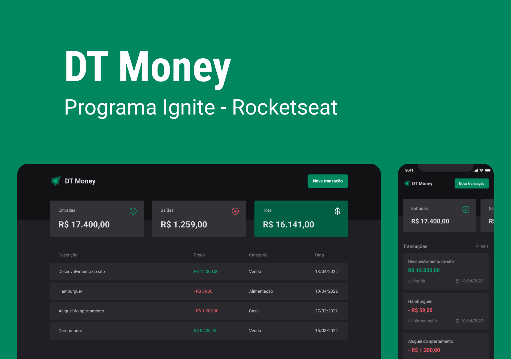

<div align="center">
  
  <h3>Sistema de controle financeiro desenvolvido para a trilha de react do bootcamp ignite da rocketseat</h3>
</div>

## 📃 Sobre

<br />

Este projeto aborda assuntos que são muito importantes para qualquer aplicação web utilizando bibliotecas atuais que ajudam o desenvolvedor a resolver problemas mais facilmente, como por exemplo: React-hook-form (para validação de formulários) e Radix (utilizada para criação de componentes primitivos com acessibilidade). 

## 💻 Principais Tecnologias utilizadas no projeto

Este projeto possui diversas bibliotecas que são bem úteis e agilizam muito o processo de desenvolvimento de uma aplicação. abaixo você pode ver quais são essas bibliotecas:

- [Vite](https://vitejs.dev/)
- [React](https://pt-br.reactjs.org/)
- [Typescript](https://www.typescript)
- [Styled-components](https://styled-components.com/)
- [Phosphor-icons](https://phosphoricons.com/)
- [Json-server](https://www.npmjs.com/package/json-server)
- [Radix](https://www.radix-ui.com/)
- [Zod](https://www.npmjs.com/package/zod)
- [React-hook-form](https://www.react-hook-form.com/get-started)

## Funcionalidades

Este projeto possui algumas funcionalidades bem legais que ajudam muito os iniciantes no desenvolvimento web com react. as funcionalidades são:

- Listagem de transações

- Filtragem de transações

- Cálculo de transações (entradas, saídas e total)

- Criação de uma nova transação

## Como executar o projeto na sua máquina

<br />

Para executar o projeto você terá de seguir os passos listados abaixo. 

Primeiro clone o repositório do projeto com o comando:

<br />

```bash
git clone git@github.com:henrique998/DT-Money.git
```

Execute um dos comando abaixo para instalar as dependências do projeto:

```bash
npm install
# OU
yarn install
```

<br />

Execute o comando abaixo para inicializar a fake-api:

```bash
npm run server
# OU
yarn server
```

<br />

Agora está tudo pronto para iniciar o projeto. execute o comando abaixo para iniciar o servidor da aplicação:

<br />

```bash
npm run dev
# OU
yarn dev
```

## Contato

<br />

Entre em contato comigo por email ou no linkedin:

- henriquemonteiro037@gmail.com
- [linkedin](https://www.linkedin.com/in/henrique-monteiro1/)